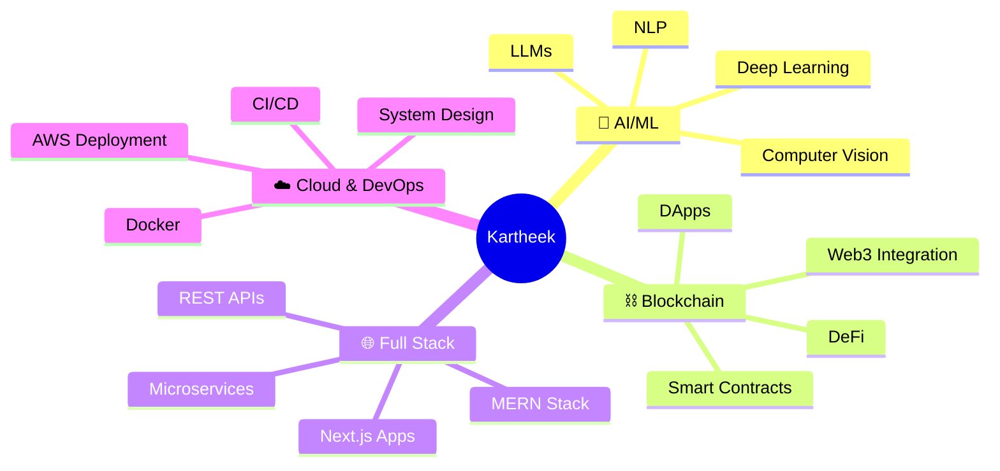

<div align="center">

<!-- Animated Header -->


<!-- Typing Animation -->


<br/>

<!-- Animated Badges -->
<p>
  
  
  
</p>

<!-- Profile Views Counter -->


</div>

<br/>

<!-- Animated Divider -->


<br/>

## 🚀 ABOUT ME

```javascript
const kartheek = {
  role: "Devops & Backend Engineer",
  skills: ["Python", "Java", "JavaScript", "C++", "SQL"],
  focus: ["AI/ML", "System Design", "Backend Development"],
  tools: ["FastAPI", "Spring Boot", "React", "Docker", "AWS"],
  databases: ["MongoDB", "PostgreSQL", "Redis"],
  learning: ["LLMs", "Scalable Systems", "Cloud Architecture"],
  funFact: "I build systems that scale, not just code "
};
```

<br/>


<br/>

## 💻 TECH ARSENAL

<div align="center">

### 🤖 AI & Machine Learning
<p>
  
  
  
  
  
  
  
  
</p>

### ⛓️ Blockchain & Web3
<p>
  
  
  
  
  
</p>

### 🎨 Frontend Development
<p>
  
  
  
  
  
  
  
</p>

### ⚙️ Backend Development
<p>
  
  
  
  
  
  
</p>

### 🗄️ Databases
<p>
  
  
  
  
  
</p>

### ☁️ DevOps & Cloud
<p>
  
  
  
  
  
  
</p>

### 🛠️ Tools & IDEs
<p>
  
  
  
  
</p>

</div>

<br/>


<br/>

## 🎯 WHAT I'M UP TO

<div align="center">



</div>

<br/>


<br/>

## 🎨 SKILL VISUALIZATION

<div align="center">


<br/><br/>

<!-- Skill Icons -->


</div>

<br/>


<br/>

## 💡 PHILOSOPHY

<div align="center">

### 🎯 My Approach

```ascii
┌─────────────────────────────────────────────────┐
│  "Code is like humor.                           │
│   When you have to explain it, it's bad."       │
│                                                 │
│           - Cory House                          │
└─────────────────────────────────────────────────┘
```

<table>
  <tr>
    <td align="center" width="50%">
      
      <br/>
      <b>🚀 Innovation First</b>
      <br/>
      <sub>Building cutting-edge solutions</sub>
    </td>
    <td align="center" width="50%">
      
      <br/>
      <b>📚 Continuous Learning</b>
      <br/>
      <sub>Growing every single day</sub>
    </td>
  </tr>
  <tr>
    <td align="center" width="50%">
      
      <br/>
      <b>🤝 Collaboration</b>
      <br/>
      <sub>Open to partnerships</sub>
    </td>
    <td align="center" width="50%">
      
      <br/>
      <b>🎯 Problem Solving</b>
      <br/>
      <sub>Solutions, not excuses</sub>
    </td>
  </tr>
</table>

</div>

<br/>


<br/>

## 🌊 CURRENT WAVE

<div align="center">

<table>
  <tr>
    <th>🔭 Working On</th>
    <th>🌱 Learning</th>
    <th>💬 Ask Me About</th>
  </tr>
  <tr>
    <td>
      • AI-Powered DApps<br/>
      • Smart Contract Systems<br/>
      • Full-Stack AI Solutions<br/>
      • Cloud Architecture
    </td>
    <td>
      • Advanced LLMs<br/>
      • Zero-Knowledge Proofs<br/>
      • System Design at Scale<br/>
      • Web3 Security
    </td>
    <td>
      • AI/ML Engineering<br/>
      • Blockchain Development<br/>
      • Full-Stack Architecture<br/>
      • Cloud & DevOps
    </td>
  </tr>
</table>

</div>

<br/>


<br/>

## 🌐 CONNECT & COLLABORATE

<div align="center">

<a href="https://www.linkedin.com/in/saikartheekmv/">
  
</a>
<a href="mailto:venkatasaikartheekm@gmail.com">
  
</a>
<a href="https://github.com/SaiKartheekMV">
  
</a>
<a href="https://twitter.com/yourusername">
  
</a>

<br/><br/>

<!-- Social Stats -->


</div>

<br/>


<br/>

## 💭 RANDOM DEV QUOTE

<div align="center">


</div>

<br/>


<br/>


<br/>

<!-- Footer Wave -->


<div align="center">

### ✨ ***"Build skills so strong that opportunities chase you."*** ✨


<br/>

**© 2025 Kartheek | Crafted with ❤️ and ☕**

</div>
